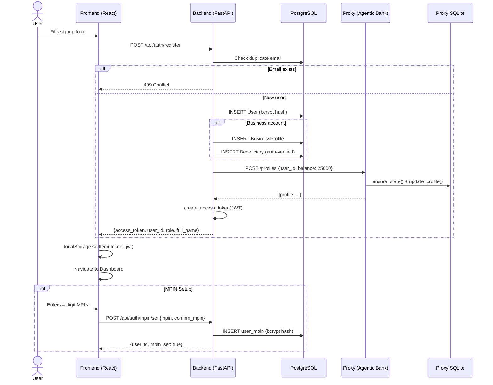

# 01 · User Onboarding

> [← README](README.md) · **User Onboarding** · [02 · Authentication →](02-authentication-sessions.md)

---

## Overview

User onboarding in CareBank spans all three repositories. The **frontend** collects credentials and renders the signup form; the **backend** validates input, creates the user row in PostgreSQL, hashes the password, and seeds the user's profile on the proxy; the **agentic-bank proxy** provisions a virtual bank account with a default balance.

After registration the user is immediately issued a JWT and redirected to the dashboard. Optionally, the user can set an MPIN (Mobile PIN) for transaction authorisation. Business accounts additionally create a `BusinessProfile` row and an auto-verified beneficiary so other users can discover and pay the business.

---

## Step-by-Step Narrative

### 1. User fills the registration form

| Repo | What happens |
|---|---|
| **Frontend** | `Login.tsx` renders the signup tab. User enters email, password, full name, phone (optional), and account type (`personal` or `business`). For business accounts, additional fields appear: `business_name`, `business_category`, `business_description`. |
| **Backend** | — |
| **Proxy** | — |

### 2. Frontend submits `POST /api/auth/register`

| Repo | What happens |
|---|---|
| **Frontend** | `Login.tsx` calls `api.post('/api/auth/register', body)` via the Axios instance configured in `lib/api`. |
| **Backend** | `auth.py → register()` validates the request: checks for duplicate email (409 if exists), validates `account_type`, validates business fields if applicable. |
| **Proxy** | — |

### 3. Backend creates the user

| Repo | What happens |
|---|---|
| **Backend** | Generates a unique `user_id` (format: `user_{uuid[:8]}`). Creates a `User` row with bcrypt-hashed password, role (`user` or `business`), and `is_active=True`. For business accounts: creates `BusinessProfile` and auto-verified `Beneficiary`. |
| **Proxy** | — |

### 4. Backend seeds the proxy profile

| Repo | What happens |
|---|---|
| **Backend** | Calls `get_banking_client().create_profile(user_id, balance=25000.0)` — this is an async HTTP POST to the proxy. Failure is non-fatal (logged as warning). |
| **Proxy** | `POST /profiles` (admin-only). Calls `ensure_state()` to initialise user state, then `update_profile()` to set `current_balance=25000.0`. State is persisted in SQLite. |

### 5. Backend returns JWT token

| Repo | What happens |
|---|---|
| **Backend** | Creates a JWT with `{user_id, email, role}` and configurable expiry (default 24h). Returns `TokenResponse`. |
| **Frontend** | `AuthContext.login(token, user)` stores the token in `localStorage` and sets `user` in React state. The router redirects to `/` (Dashboard). |

### 6. Optional: MPIN setup

| Repo | What happens |
|---|---|
| **Frontend** | `MPINSetup.tsx` component prompts the user to set a 4-digit MPIN. |
| **Backend** | `POST /api/auth/mpin/set` → `mpin_service.set_mpin()` hashes the MPIN with bcrypt and stores it in the `user_mpin` table. |

---

## Sequence Diagram



---

## Example Scenario

### Personal Account Registration

**Request:**
```json
POST /api/auth/register
{
  "email": "priya@example.com",
  "password": "SecurePass123!",
  "full_name": "Priya Sharma",
  "phone_number": "+919876543210",
  "account_type": "personal"
}
```

**Response (201 Created):**
```json
{
  "access_token": "eyJhbGciOiJIUzI1NiIsInR5cCI6IkpXVCJ9...",
  "token_type": "bearer",
  "user_id": "user_a3f7c1e2",
  "role": "user",
  "full_name": "Priya Sharma"
}
```

**Proxy seed call (internal):**
```json
POST http://proxy:8001/profiles
Authorization: Bearer <admin-signed-jwt>

{
  "user_id": "user_a3f7c1e2",
  "current_balance": 25000.0
}
```

### Business Account Registration

**Request:**
```json
POST /api/auth/register
{
  "email": "billing@acmecorp.com",
  "password": "BizSecure456!",
  "full_name": "ACME Corp Admin",
  "account_type": "business",
  "business_name": "ACME Corporation",
  "business_category": "utilities",
  "business_description": "Water and electricity provider"
}
```

**Side effects:** Creates `BusinessProfile` + auto-verified `Beneficiary` so users can search and pay ACME Corp.

---

## Decision Table

| Trigger | System Action | Outcome |
|---|---|---|
| Email already registered | Reject with 409 | User prompted to login instead |
| `account_type` not `personal`/`business` | Reject with 400 | Validation error returned |
| Business account missing `business_name` | Reject with 400 | Required field error |
| Proxy unreachable during profile seed | Log warning, continue | User created without proxy state (seeded on first use) |
| MPIN confirmation mismatch | Reject with 400 | User re-prompted |
| Unique user_id collision (10 attempts) | Reject with 500 | Extremely rare edge case |

---

| ← Previous          | Current                  | Next →                                               |
| ------------------- | ------------------------ | ---------------------------------------------------- |
| [README](README.md) | **01 · User Onboarding** | [02 · Authentication](02-authentication-sessions.md) |
