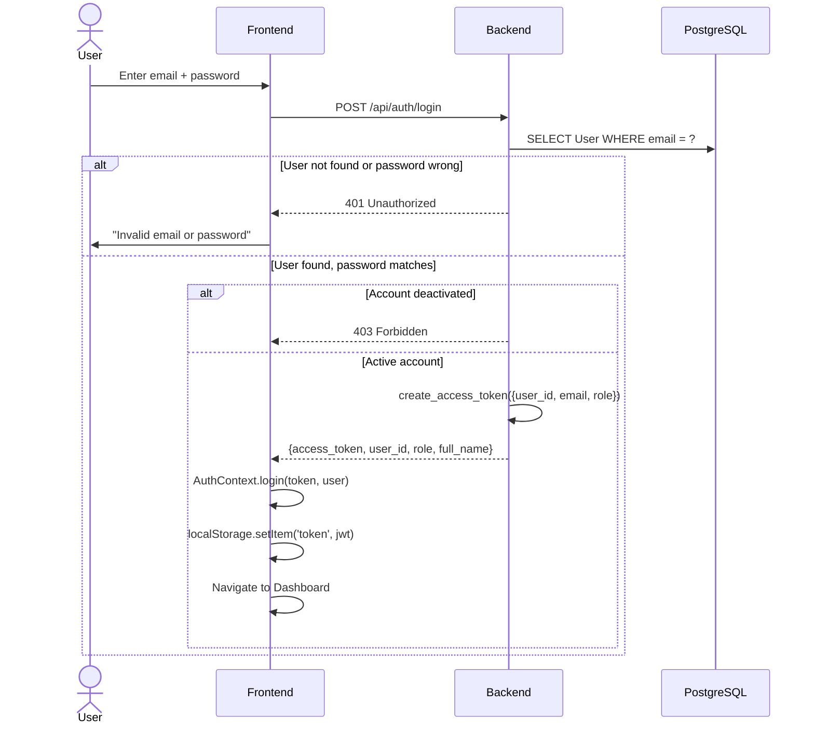
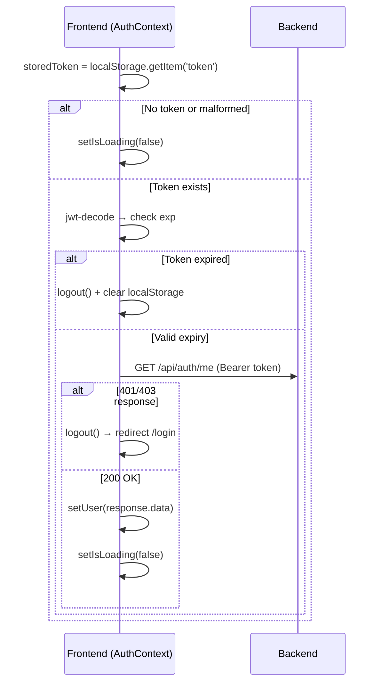
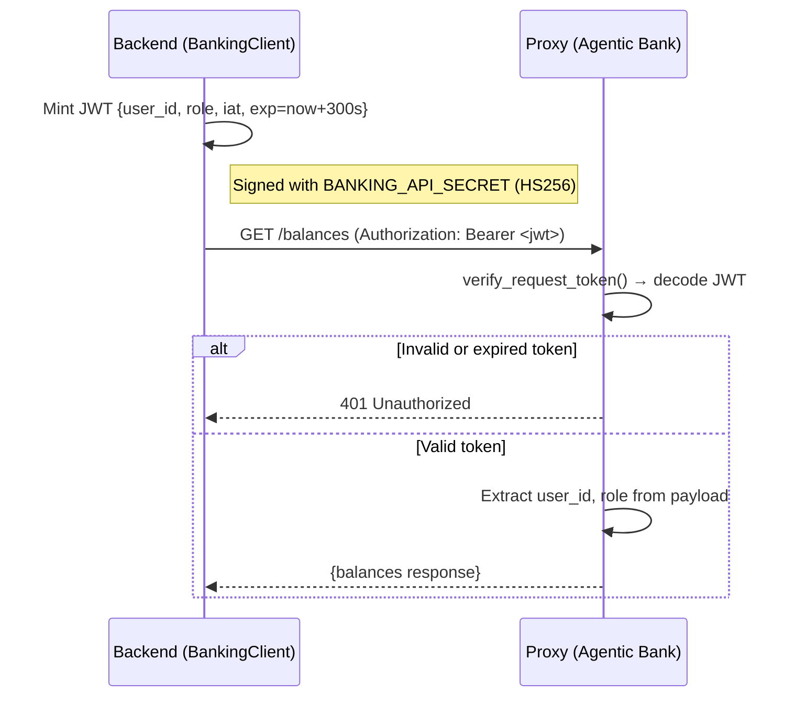
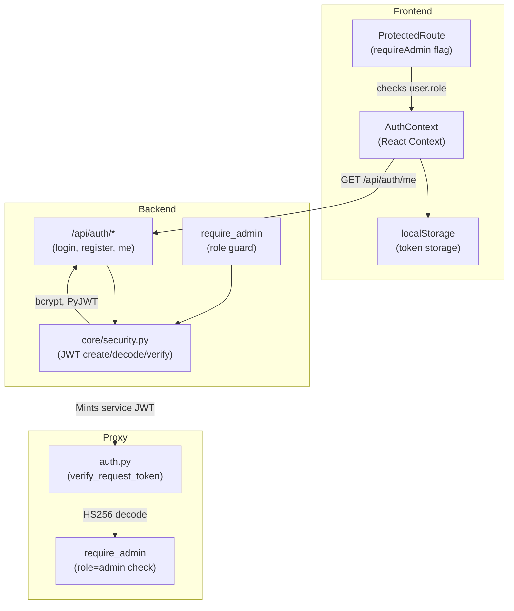

# 02 · Authentication & Session Management

> [← 01 · User Onboarding](01-user-onboarding.md) · **Authentication & Sessions** · [03 · Agent Pipeline →](03-agent-pipeline.md)

---

## Overview

CareBank uses a **dual-JWT architecture**. The **backend** issues user-facing JWTs (signed with `JWT_SECRET`, derived from `BANKING_API_SECRET` via SHA-256 if not set explicitly) for frontend authentication. The **backend also mints short-lived service JWTs** (signed with `BANKING_API_SECRET`, 5-minute TTL) for authenticating its requests to the agentic-bank proxy.

The frontend stores the user JWT in `localStorage`. On each page load, `AuthContext` validates the token client-side (expiry check via `jwt-decode`) and then confirms it server-side with `GET /api/auth/me`. If either check fails, the user is logged out and redirected to `/login`.

Admin users are created via the one-time `POST /api/auth/bootstrap-super-admin` endpoint (blocked after first admin exists). Admin routes are guarded at both the frontend (React `ProtectedRoute` with `requireAdmin`) and backend (`require_admin` dependency).

---

## Step-by-Step: Login Flow



---

## Step-by-Step: Session Restore on Page Reload



---

## Backend ↔ Proxy Authentication

The backend authenticates to the proxy using **short-lived JWTs** signed with `BANKING_API_SECRET`:



---

## Example Payloads

### Login Request
```json
POST /api/auth/login
{
  "email": "priya@example.com",
  "password": "SecurePass123!"
}
```

### Login Response
```json
{
  "access_token": "eyJhbGciOiJIUzI1NiJ9.eyJ1c2VyX2lkIjoiMTIzIiwiZW1haWwiOiJwcml5YUBleGFtcGxlLmNvbSIsInJvbGUiOiJ1c2VyIiwiZXhwIjoxNzE2MzIwMDAwfQ.signature",
  "token_type": "bearer",
  "user_id": "user_a3f7c1e2",
  "role": "user",
  "full_name": "Priya Sharma"
}
```

### JWT Payload (decoded)
```json
{
  "user_id": "user_a3f7c1e2",
  "email": "priya@example.com",
  "role": "user",
  "iat": 1716233600,
  "exp": 1716320000
}
```

### Backend → Proxy Service JWT (internal)
```json
{
  "user_id": "user_a3f7c1e2",
  "role": "user",
  "iat": 1716233600,
  "exp": 1716233900
}
```

---

## Decision Table

| Trigger | System Action | Outcome |
|---|---|---|
| Valid email + password | Issue JWT, return token | User redirected to dashboard |
| Wrong password | 401 Unauthorized | Error shown on login form |
| Deactivated account | 403 Forbidden | "Account is deactivated" message |
| Expired JWT on frontend | Client-side decode check | Auto-logout, redirect to `/login` |
| `GET /api/auth/me` fails | Server-side session check | Logout + redirect |
| Admin bootstrap attempted twice | 409 Conflict | "Super admin already exists" |
| Proxy receives expired service JWT | 401 at proxy level | Backend logs error, falls back to mock data |
| `BANKING_API_SECRET` not configured | Proxy returns 503 | Proxy cannot decode any tokens |

---

## Component Diagram



---

| ← Previous | Current | Next → |
|---|---|---|
| [01 · User Onboarding](01-user-onboarding.md) | **02 · Authentication & Sessions** | [03 · Agent Pipeline](03-agent-pipeline.md) |
