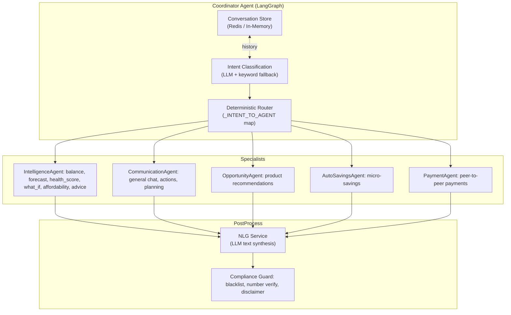
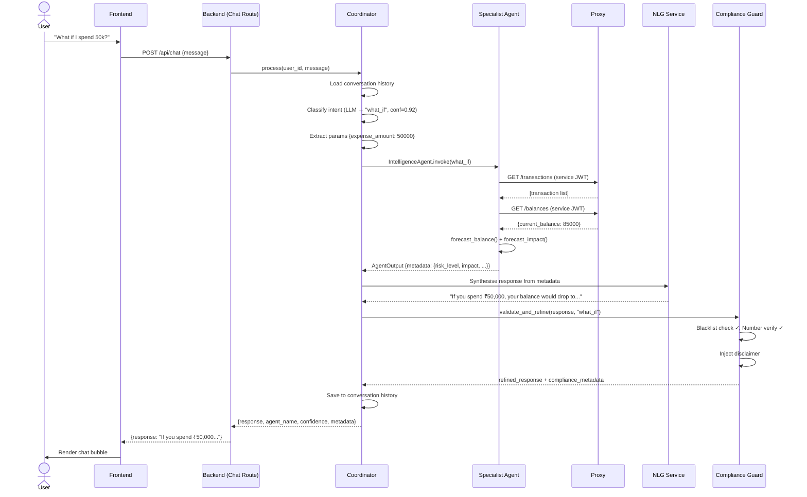

# 03 · Conversational Agent Pipeline

> [← 02 · Authentication](02-authentication-sessions.md) · **Agent Pipeline** · [04 · Health Score →](04-health-score.md)

---

## Overview

CareBank's conversational AI is orchestrated by a **Coordinator agent** that uses a LangGraph state machine (with a lightweight fallback when LangGraph is not installed). When a user sends a chat message, the Coordinator classifies intent via LLM-backed structured output, routes to the appropriate specialist agent, synthesises a natural-language response via the NLG service, and passes it through the Compliance Guard before returning it to the user.

The system supports **five specialist agents**: IntelligenceAgent (balance, forecast, health score, what-if, affordability, advice), CommunicationAgent (general chat, actions, planning), OpportunityAgent (product recommendations), AutoSavingsAgent (micro-savings), and PaymentAgent (one-time peer-to-peer payments). The Coordinator maintains per-user conversation history (Redis-backed with in-memory fallback) to support multi-turn dialogue and pending-intent resumption.

All agent responses flow through the **Compliance Guard** which performs blacklist-term redaction, number-hallucination detection, and automated disclaimer injection for financial intents. Every interaction is logged to an audit trail.

---

## Agent Architecture

---

## Step-by-Step: Chat Message Processing

### 1. User sends a chat message

| Repo | What happens |
|---|---|
| **Frontend** | `Chat.tsx` sends `POST /api/chat` with `{message: "What if I spend 50k?"}` |
| **Backend** | `chat.py` receives the message, extracts `user_id` from JWT |

### 2. Coordinator classifies intent

| Repo | What happens |
|---|---|
| **Backend** | Coordinator checks for **contextual overrides** (e.g. pending planning flow, schedule signals). Then attempts **LLM-based classification** using structured output (`ClassificationResult`). Falls back to **keyword matching** if LLM is unavailable. |

### 3. Route to specialist agent

| Repo | What happens |
|---|---|
| **Backend** | Coordinator uses `_INTENT_TO_AGENT` map: `what_if → IntelligenceAgent`. Constructs `AgentInput(user_id, message, intent, context)` and calls `agent.invoke()`. |

### 4. Agent processes and fetches data

| Repo | What happens |
|---|---|
| **Backend** | IntelligenceAgent calls `get_transactions_sync()` and `get_balance_sync()` which make HTTP requests to the proxy. |
| **Proxy** | Returns transactions and balance data from SQLite state store (optionally enriched by Gemini AI). |

### 5. NLG synthesises response

| Repo | What happens |
|---|---|
| **Backend** | NLG service takes the agent's structured `metadata` and uses LLM to generate a user-friendly natural-language response. Falls back to template-based response if LLM unavailable. |

### 6. Compliance Guard validates

| Repo | What happens |
|---|---|
| **Backend** | `validate_and_refine()` checks for blacklisted terms (e.g. "guarantee", "risk-free"), verifies numbers against source data, injects disclaimers for financial intents. Logs compliance decision to `AuditLog`. |

### 7. Response returned to user

| Repo | What happens |
|---|---|
| **Backend** | Returns the refined response with agent metadata to the frontend. |
| **Frontend** | `Chat.tsx` renders the response in the chat UI. |

---

## Sequence Diagram

---

## Intent Classification Map

| Intent          | Agent              | Example Triggers                                |
| --------------- | ------------------ | ----------------------------------------------- |
| `balance`       | IntelligenceAgent  | "what's my balance", "how much do I have"       |
| `forecast`      | IntelligenceAgent  | "predict next month", "future balance"          |
| `health_score`  | IntelligenceAgent  | "financial health", "how am I doing"            |
| `what_if`       | IntelligenceAgent  | "what if I spend 50k", "impact of buying"       |
| `affordability` | IntelligenceAgent  | "can I buy a phone for 30k", "should I buy"     |
| `advice`        | IntelligenceAgent  | "how to save more", "where am I overspending"   |
| `auto_savings`  | AutoSavingsAgent   | "save money", "micro savings", "budget"         |
| `opportunity`   | OpportunityAgent   | "recommend products", "any offers"              |
| `planning`      | CommunicationAgent | "schedule rent", "recurring payment", "autopay" |
| `payment`       | PaymentAgent       | "pay 5000 to Ravi"                              |
| `actions`       | CommunicationAgent | "approve action #3", "reject request"           |
| `general`       | CommunicationAgent | "hello", "thanks", non-financial chat           |

---

## Example Scenario: Multi-Turn Conversation

**Turn 1 — User:** "What if I spend 50k on a laptop?"
- Intent: `what_if`, Agent: IntelligenceAgent
- Response: "If you spend ₹50,000, your projected end-of-month balance drops from ₹85,000 to ₹35,000 — a medium risk. You'd retain 41% of your forecasted balance."

**Turn 2 — User:** "Can I afford it though?"
- Intent: `affordability` (secondary from context), Agent: IntelligenceAgent
- Response: "With your available balance of ₹82,000, a ₹50,000 purchase leaves ₹32,000 — above the safe buffer (₹10,000). Verdict: affordable, but tight."

**Turn 3 — User:** "Schedule my rent payment of 15k on the 5th of every month"
- Intent: `planning`, Agent: CommunicationAgent
- Context switch detected by Coordinator → routes to planning flow

---

## Decision Table

| Trigger | Coordinator Action | Outcome |
|---|---|---|
| Clear financial intent with high LLM confidence (>0.7) | Route to mapped specialist | Normal agent invocation |
| LLM unavailable or low confidence | Keyword fallback matching | Best-effort intent routing |
| Pending `planning` context + user says "yes" | Resume planning flow | Skip re-classification |
| Pending `actions` context + user says "approve" | Resume actions flow | Execute action approval |
| Amount-only message ("15000") during schedule context | Auto-classify as `planning` | Set amount parameter |
| Agent returns `needs_input` status | Coordinator asks clarifying question | User prompted for missing param |
| Compliance Guard detects blacklisted term | Term redacted from response | `[REDACTED]` replaces offending term |
| Number hallucination detected | Flag logged but response sent | Warning in compliance metadata |

---

| ← Previous | Current | Next → |
|---|---|---|
| [02 · Authentication](02-authentication-sessions.md) | **03 · Agent Pipeline** | [04 · Health Score](04-health-score.md) |
