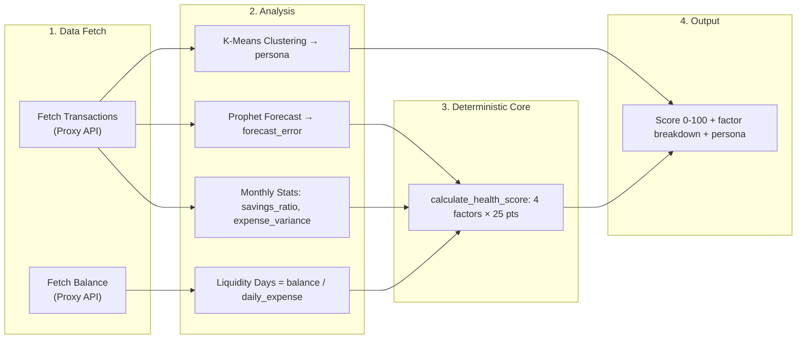
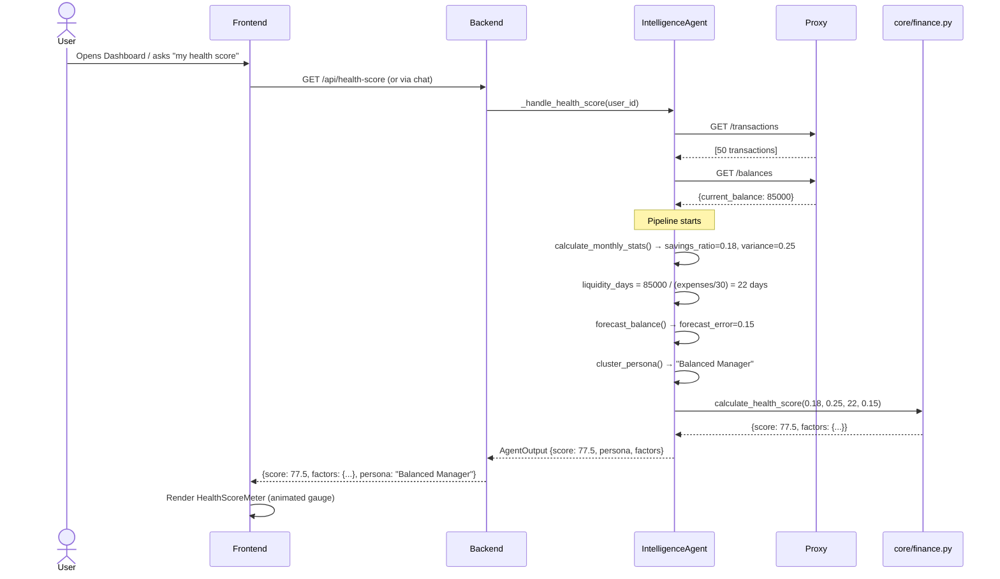
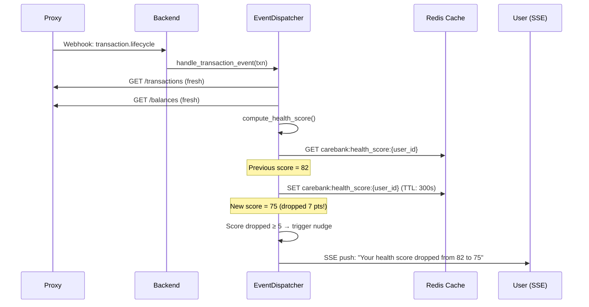

# 04 · Financial Health Score

> [← 03 · Agent Pipeline](03-agent-pipeline.md) · **Health Score** · [05 · What-If Simulator →](05-what-if-simulator.md)

---

## Overview

The Financial Health Score is CareBank's flagship insight feature — a **composite 0–100 score** calculated from four equally-weighted deterministic factors. No LLM is involved in the score computation itself; the LLM only handles natural-language presentation of the results.

The pipeline works as follows: transaction data is fetched from the proxy, monthly stats are calculated (savings ratio, expense variance), liquidity days are derived from balance and daily expenses, forecast error comes from Prophet-based time-series prediction, and a persona is assigned via K-Means clustering. All four signals feed into a deterministic formula in `core/finance.py` that produces the final score.

The health score is **event-driven**: it can be recomputed asynchronously whenever a new transaction arrives via the `EventDispatcher`, cached in Redis for 5 minutes, and served instantly on subsequent requests. If the score drops by 5+ points, a nudge notification is automatically sent to the user.

---

## Score Computation Pipeline



---

## Factor Breakdown (25 Points Each)

| Factor         | Input              | Formula                       | Max | "Good" Threshold   |
| -------------- | ------------------ | ----------------------------- | --- | ------------------ |
| **Savings**    | `savings_ratio`    | `min(ratio / 0.20, 1.0) × 25` | 25  | ≥ 15% savings rate |
| **Stability**  | `expense_variance` | `max(1 - variance, 0) × 25`   | 25  | Variance < 0.30    |
| **Liquidity**  | `liquidity_days`   | `min(days / 30, 1.0) × 25`    | 25  | ≥ 15 days coverage |
| **Confidence** | `forecast_error`   | `max(1 - error, 0) × 25`      | 25  | Error < 0.20       |

**Total Score** = sum of all four factor scores (0–100).

---

## Sequence Diagram



---

## Example Scenario

**User Profile:** Priya, balance ₹85,000, moderate spender, saving 18% monthly.

**Input Data:**
```json
{
  "transactions": [
    {"amount": -3500, "category": "food", "date": "2026-05-15"},
    {"amount": -15000, "category": "rent", "date": "2026-05-01"},
    {"amount": 75000, "category": "salary", "date": "2026-05-01"},
    {"amount": -2000, "category": "utilities", "date": "2026-05-03"}
  ],
  "current_balance": 85000.0
}
```

**Computed Factors:**

| Factor | Value | Score | Label |
|---|---|---|---|
| Savings | ratio = 0.18 | 22.5 / 25 | Good |
| Stability | variance = 0.25 | 18.8 / 25 | Stable |
| Liquidity | 22 days | 18.3 / 25 | Good |
| Confidence | error = 0.15 | 21.3 / 25 | High |

**Final Score: 80.9 / 100** — Persona: "Balanced Manager"

**Response (API):**
```json
{
  "score": 80.9,
  "factors": {
    "savings": {"value": 0.18, "score": 22.5, "label": "Good"},
    "stability": {"value": 0.25, "score": 18.8, "label": "Stable"},
    "liquidity": {"value": 22, "score": 18.3, "label": "Good"},
    "confidence": {"value": 0.15, "score": 21.3, "label": "High"}
  },
  "persona": "Balanced Manager",
  "forecast": {
    "predicted_balance": 82000,
    "forecast_error": 0.15
  },
  "stats": {
    "income": 75000,
    "expenses": 20500,
    "savings_ratio": 0.18,
    "expense_variance": 0.25
  }
}
```

---

## Event-Driven Recomputation



---

## Frontend Visualization

The `HealthScoreMeter.tsx` component renders an animated circular gauge:
- **0–40**: Red zone — "Needs Attention"
- **41–70**: Yellow zone — "Room for Improvement"
- **71–100**: Green zone — "Healthy"

Factor breakdowns are shown as horizontal bars beneath the gauge.

---

## Decision Table

| Trigger                           | System Action                            | Outcome                            |
| --------------------------------- | ---------------------------------------- | ---------------------------------- |
| User asks "my health score"       | IntelligenceAgent computes full pipeline | Score + breakdown returned         |
| New transaction arrives (webhook) | EventDispatcher recomputes score         | Redis cache updated                |
| Score drops ≥ 5 points vs cached  | Nudge sent via CommunicationAgent        | User notified via SSE/Telegram     |
| Proxy unreachable (dev mode)      | Fallback to mock transactions            | Score computed from synthetic data |
| Proxy unreachable (production)    | Error raised                             | 500 returned to user               |

---

| ← Previous | Current | Next → |
|---|---|---|
| [03 · Agent Pipeline](03-agent-pipeline.md) | **04 · Health Score** | [05 · What-If Simulator](05-what-if-simulator.md) |
