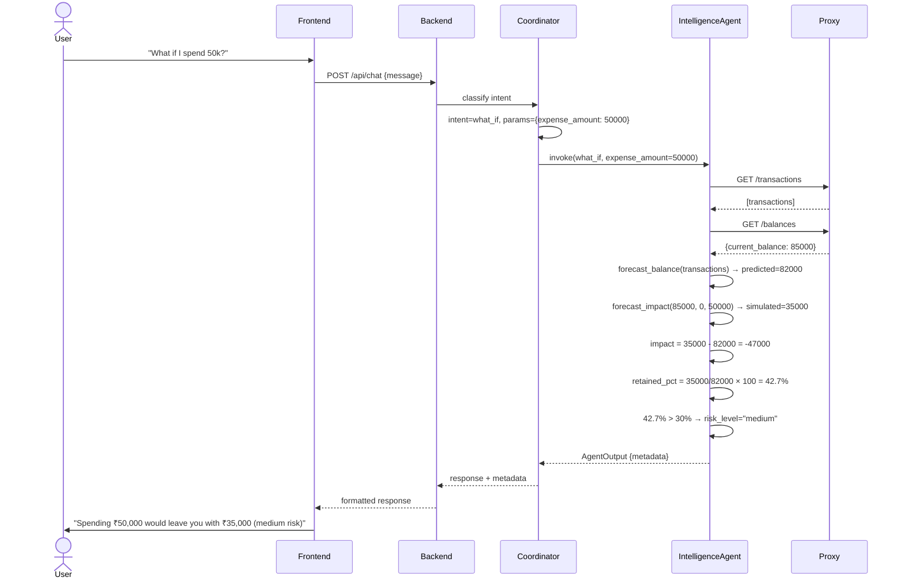
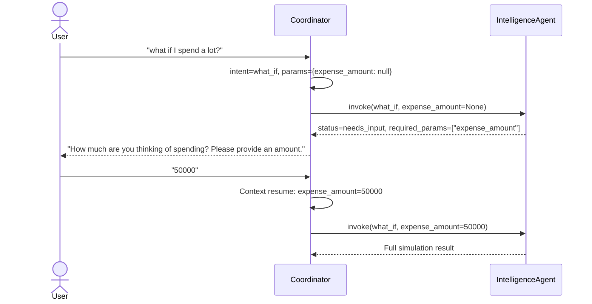

# 05 · What-If Simulator

> [← 04 · Health Score](04-health-score.md) · **What-If Simulator** · [06 · Transaction Lifecycle →](06-transaction-lifecycle.md)

---

## Overview

The What-If Simulator lets users ask hypothetical questions like "What if I spend ₹50,000 on a laptop?" and see the projected impact on their finances. The simulation is entirely **deterministic** — the core calculation uses `forecast_impact()` from `core/finance.py`, which simply computes `current_balance - scheduled_expenses - simulated_expense`.

The Intelligence Agent handles the what-if intent by fetching current balance and transactions from the proxy, running a Prophet-based forecast for the predicted end-of-month balance, then computing the simulated balance. The result includes impact amount, percentage retained, and a risk classification (low/medium/high) based on configurable thresholds.

The frontend exposes this both through the **Chat interface** (natural-language "what if..." questions) and a dedicated **Simulator page** with interactive sliders for expense amount.

---

## Sequence Diagram



---

## Risk Classification Thresholds

| Retained % | Risk Level | Meaning |
|---|---|---|
| > 70% | 🟢 **Low** | Expense is well within budget |
| 30% – 70% | 🟡 **Medium** | Feasible but impacts buffer |
| < 30% | 🔴 **High** | Significantly drains reserves |

Thresholds are configurable via environment variables:
- `WHATIF_LOW_THRESHOLD=70.0`
- `WHATIF_MEDIUM_THRESHOLD=30.0`

---

## Example Scenarios

### Scenario A: Low-Risk Purchase (₹5,000)

```json
// Input
{ "expense_amount": 5000 }

// Agent Metadata Output
{
  "intent_handled": "what_if",
  "expense_amount": 5000,
  "current_balance": 85000,
  "predicted_balance": 82000,
  "simulated_balance": 80000,
  "impact": -2000,
  "risk_level": "low",
  "retained_pct": 97.6
}
```

**Response:** "If you spend ₹5,000, your projected balance would be ₹80,000 — still very healthy. This is a low-risk purchase."

### Scenario B: Medium-Risk Purchase (₹50,000)

```json
{
  "intent_handled": "what_if",
  "expense_amount": 50000,
  "current_balance": 85000,
  "predicted_balance": 82000,
  "simulated_balance": 35000,
  "impact": -47000,
  "risk_level": "medium",
  "retained_pct": 42.7
}
```

**Response:** "Spending ₹50,000 would reduce your projected balance to ₹35,000, retaining 42.7% of your forecast. This is a medium-risk move."

### Scenario C: High-Risk Purchase (₹75,000)

```json
{
  "intent_handled": "what_if",
  "expense_amount": 75000,
  "current_balance": 85000,
  "predicted_balance": 82000,
  "simulated_balance": 10000,
  "impact": -72000,
  "risk_level": "high",
  "retained_pct": 12.2
}
```

**Response:** "⚠️ Spending ₹75,000 would leave only ₹10,000 — just 12.2% of your forecast. This is high risk and could leave you short for upcoming bills."

---

## Missing Parameter Flow

If the user asks "what if I spend a lot?" without specifying an amount:



---

## Dedicated Simulator Page

The `Simulator.tsx` page provides:
- **Amount slider** for interactive exploration
- **API call:** `POST /api/simulate` with `{expense_amount, category}`
- **Visual:** Chart showing current → simulated balance with risk colour coding
- Real-time updates as slider moves (debounced API calls)

---

## Decision Table

| Trigger | Agent Action | Outcome |
|---|---|---|
| User provides expense amount | Full simulation pipeline | Risk-classified result |
| No expense amount provided | Return `needs_input` status | User prompted for amount |
| Retained % > 70% | Classify as low risk | Green indicator |
| Retained % 30-70% | Classify as medium risk | Yellow indicator |
| Retained % < 30% | Classify as high risk | Red warning |
| Proxy unreachable (dev) | Fallback to mock data | Simulation still works |
| Proxy unreachable (prod) | Error raised | 500 error |

---

| ← Previous | Current | Next → |
|---|---|---|
| [04 · Health Score](04-health-score.md) | **05 · What-If Simulator** | [06 · Transaction Lifecycle](06-transaction-lifecycle.md) |
