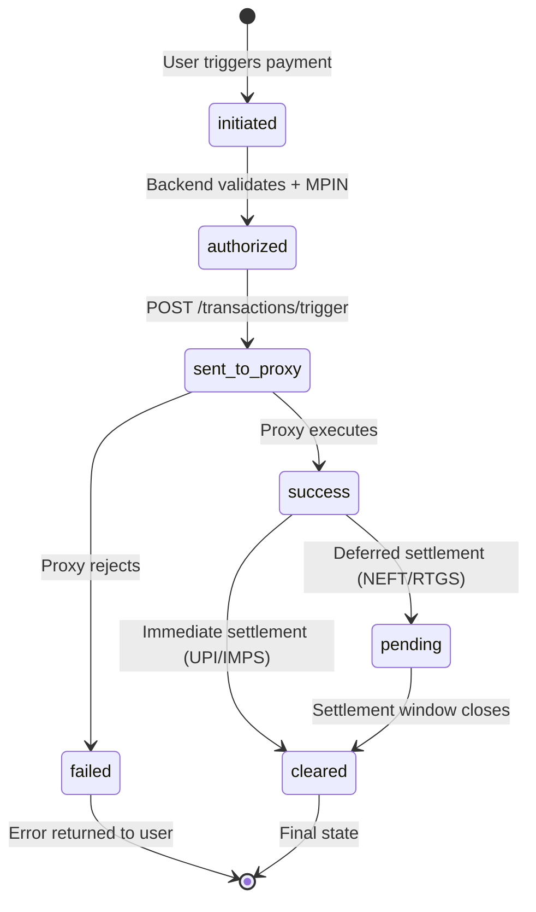
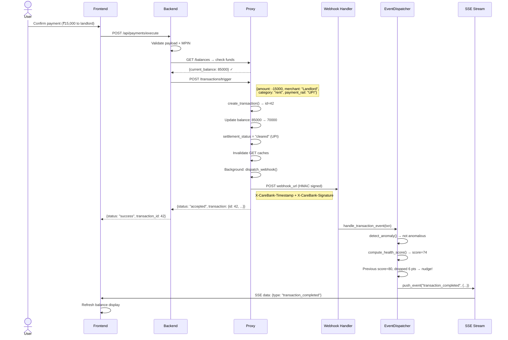

# 06 · Transaction Lifecycle

> [← 05 · What-If Simulator](05-what-if-simulator.md) · **Transaction Lifecycle** · [07 · Recurring Payments →](07-recurring-payments.md)

---

## Overview

Transactions in CareBank flow through a multi-stage lifecycle spanning all three repositories. The **frontend** initiates a payment through the transaction modal or chat. The **backend** validates the request, resolves payment method and beneficiary, then delegates to the **proxy** via `POST /transactions/trigger`. The proxy creates the transaction record, updates balances, determines settlement status (cleared vs. pending based on payment rail), dispatches a webhook back to the backend, and invalidates stale caches.

The proxy supports **HMAC-signed webhooks** with configurable retry attempts and exponential backoff. Failed webhooks are stored in a **dead-letter queue** that admins can replay from the admin panel.

---

## Lifecycle States



---

## Step-by-Step Narrative

### 1. User initiates payment

| Repo | What happens |
|---|---|
| **Frontend** | `TransactionModal.tsx` collects amount, beneficiary, payment method. User confirms with MPIN if required. |
| **Backend** | — |

### 2. Backend validates and authorises

| Repo | What happens |
|---|---|
| **Backend** | `payment_execution_service.py → execute_generic_payment()` validates the payload, checks MPIN, verifies beneficiary exists, checks balance sufficiency via proxy. |
| **Proxy** | `GET /balances` called to verify funds. |

### 3. Backend triggers transaction on proxy

| Repo | What happens |
|---|---|
| **Backend** | `banking_client.trigger_transaction()` sends `POST /transactions/trigger` with payload. |
| **Proxy** | `create_transaction()` in `state.py` generates transaction ID, updates balances. Settlement status determined by `payment_rail`: UPI/IMPS = `cleared`, NEFT/RTGS = `pending`. |

### 4. Proxy dispatches webhook

| Repo | What happens |
|---|---|
| **Proxy** | `dispatch_webhook()` fires an HMAC-signed POST to the backend's webhook URL. Up to 3 retry attempts with configurable backoff. If all attempts fail → dead-letter queue. |
| **Backend** | Webhook endpoint receives `transaction.lifecycle` event. Triggers `handle_transaction_event()` in EventDispatcher. |

### 5. Backend processes event

| Repo | What happens |
|---|---|
| **Backend** | EventDispatcher: anomaly detection, health score recomputation, nudge if score drops ≥ 5 points. Pushes SSE event to connected frontend clients. |
| **Frontend** | `useEventStream` hook receives the transaction event, updates dashboard in real-time. |

### 6. Cache invalidation

| Repo | What happens |
|---|---|
| **Proxy** | After `POST /transactions/trigger`, invalidates cached GET responses for `/balances`, `/transactions`, `/accounts` for that user. |

---

## Sequence Diagram



---

## Example Payloads

### Transaction Trigger Request (Backend → Proxy)
```json
POST /transactions/trigger
Authorization: Bearer <service-jwt>

{
  "user_id": "user_a3f7c1e2",
  "amount": -15000,
  "merchant": "Ravi Kumar (Landlord)",
  "category": "rent",
  "description": "Monthly rent payment",
  "payment_rail": "UPI",
  "webhook_url": "http://backend:8000/api/webhooks/transaction",
  "metadata": {
    "source": "chat_payment",
    "beneficiary_id": "ben_xyz"
  }
}
```

### Proxy Response
```json
{
  "status": "accepted",
  "transaction": {
    "id": 42,
    "user_id": "user_a3f7c1e2",
    "amount": -15000,
    "merchant": "Ravi Kumar (Landlord)",
    "category": "rent",
    "status": "success",
    "settlement_status": "cleared",
    "created_at": "2026-05-21T04:00:00Z"
  },
  "webhook": {
    "status": "queued",
    "destination": "http://backend:8000/api/webhooks/transaction"
  }
}
```

### Webhook Payload (Proxy → Backend)
```json
POST http://backend:8000/api/webhooks/transaction
X-CareBank-Timestamp: 1716264000
X-CareBank-Signature: a1b2c3d4...sha256...

{
  "event_type": "transaction.lifecycle",
  "transaction_id": 42,
  "user_id": "user_a3f7c1e2",
  "status": "success",
  "timestamp": "2026-05-21T04:00:00Z",
  "reason": null,
  "metadata": {"source": "chat_payment"},
  "settlement_status": "cleared",
  "settlement_due_at": null
}
```

---

## Decision Table

| Trigger | System Action | Outcome |
|---|---|---|
| UPI/IMPS payment rail | `settlement_status = "cleared"` | Instant settlement |
| NEFT/RTGS payment rail | `settlement_status = "pending"` | Deferred settlement |
| Insufficient balance | Proxy rejects | Payment fails with error |
| Webhook delivery succeeds | `status = "delivered"` | Backend processes event |
| Webhook delivery fails (all retries) | Dead-letter queue | Admin can replay later |
| Transaction triggers anomaly | Nudge sent to user | "Unusual spending detected" |
| Health score drops ≥ 5 pts | Nudge sent via SSE/Telegram | "Your health score dropped" |
| Idempotency key present | Cache POST response | Duplicate requests return cached result |

---

| ← Previous | Current | Next → |
|---|---|---|
| [05 · What-If Simulator](05-what-if-simulator.md) | **06 · Transaction Lifecycle** | [07 · Recurring Payments](07-recurring-payments.md) |
