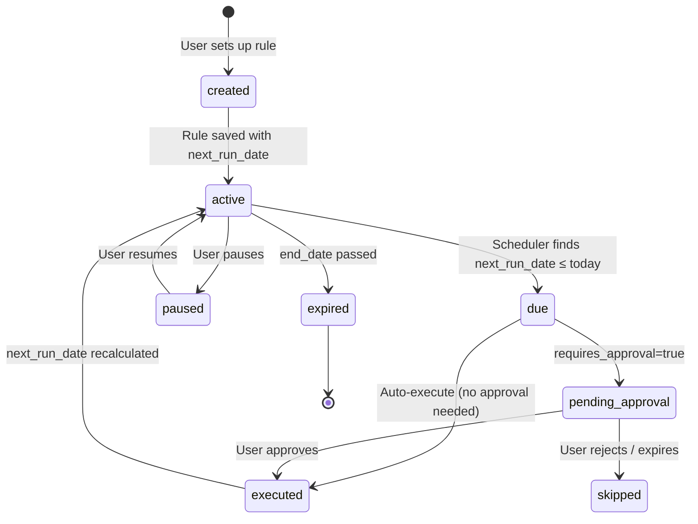
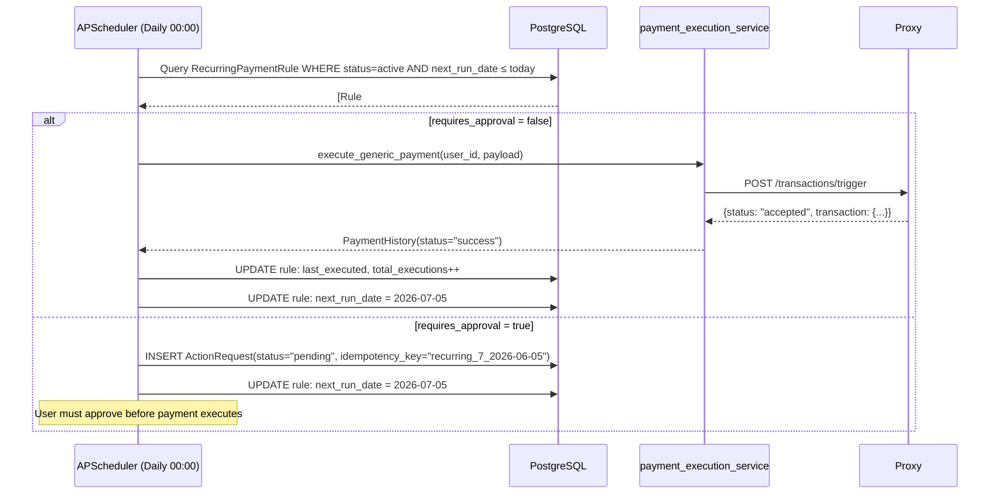

# 07 · Recurring Payments & Scheduling

> [← 06 · Transaction Lifecycle](06-transaction-lifecycle.md) · **Recurring Payments** · [08 · Auto Savings →](08-auto-savings.md)

---

## Overview

Recurring payments are managed through a combination of the **CommunicationAgent** (for natural-language setup via chat), the `RecurringPaymentRule` model (persistent storage in PostgreSQL), and the **APScheduler** background scheduler that checks and executes due payments daily at midnight UTC.

Users can create recurring rules through three interfaces: the Chat ("schedule my rent for 15k on the 5th"), the Planning page (form-based UI), or the Integration Lab (direct API calls). Each rule stores frequency, amount, day-of-month/week, beneficiary, and an optional `requires_approval` flag.

When a rule requires approval, the scheduler creates an `ActionRequest` instead of executing immediately — the user must approve via chat or the planning page before the payment fires. Rules that don't require approval are executed automatically using the `payment_execution_service`.

---

## Recurring Rule Lifecycle



---

## Step-by-Step: Chat-Based Rule Creation

### Turn 1: User requests scheduling
```
User: "Schedule my rent payment of 15k on the 5th of every month"
```

| Repo | What happens |
|---|---|
| **Frontend** | Chat.tsx sends message to backend |
| **Backend** | Coordinator detects `planning` intent via schedule signal keywords ("schedule", "every month", "on the 5th"). Routes to CommunicationAgent in planning mode. |
| **Backend** | CommunicationAgent extracts: amount=15000, day_of_month=5, recurring=true, category=rent. Asks for confirmation. |

### Turn 2: User confirms
```
User: "Yes, go ahead"
```

| Repo | What happens |
|---|---|
| **Backend** | Coordinator recognises pending `planning` context + confirmation word. Resumes planning flow. |
| **Backend** | `recurring_payment_service.py` creates `RecurringPaymentRule` with `frequency=monthly`, `day_of_month=5`, `amount=15000`, `next_run_date=2026-06-05`. |
| **Proxy** | `POST /schedules` creates a corresponding schedule on the proxy side. |

---

## Step-by-Step: Scheduler Execution



---

## Example Payloads

### Create Recurring Rule (Backend)
```json
POST /api/recurring-payments
Authorization: Bearer <user-jwt>

{
  "beneficiary_id": "ben_landlord_xyz",
  "amount": 15000,
  "frequency": "monthly",
  "day_of_month": 5,
  "description": "Monthly rent to Ravi Kumar",
  "category": "rent",
  "requires_approval": true,
  "start_date": "2026-06-01",
  "end_date": null
}
```

### RecurringPaymentRule (Database Row)
```json
{
  "id": 7,
  "user_id": "user_a3f7c1e2",
  "beneficiary_id": "ben_landlord_xyz",
  "amount": 15000,
  "frequency": "monthly",
  "day_of_month": 5,
  "description": "Monthly rent to Ravi Kumar",
  "category": "rent",
  "status": "active",
  "requires_approval": true,
  "next_run_date": "2026-06-05",
  "total_executions": 0,
  "last_executed_at": null,
  "last_execution_status": null,
  "created_at": "2026-05-21T04:00:00Z"
}
```

### Proxy Schedule (Mirror)
```json
POST /schedules
{
  "user_id": "user_a3f7c1e2",
  "schedule_type": "recurring_payment",
  "frequency": "monthly",
  "day_of_month": 5,
  "amount": 15000,
  "beneficiary_id": "ben_landlord_xyz",
  "is_active": true
}
```

---

## Manual Trigger

Users and admins can manually trigger a recurring payment execution:

```json
POST /api/recurring-payments/{rule_id}/trigger
Authorization: Bearer <user-jwt>

// Response
{
  "status": "triggered",
  "rule_id": 7,
  "execution_scheduled": true,
  "delay_seconds": 10
}
```

This calls `schedule_manual_recurring_execution()` which adds a one-shot APScheduler job with a 10-second delay.

---

## Decision Table

| Trigger | System Action | Outcome |
|---|---|---|
| User says "schedule rent 15k on 5th" | CommunicationAgent creates RecurringPaymentRule | Rule active, next_run_date set |
| Scheduler finds due rule (no approval) | Auto-execute via payment_execution_service | Payment processed, next_run_date advanced |
| Scheduler finds due rule (needs approval) | Create ActionRequest (pending) | User notified, must approve |
| User approves pending ActionRequest | Execute payment via action engine | Payment processed |
| Rule reaches `end_date` | Status → `expired` | No more executions |
| User pauses rule | Status → `paused` | Skipped by scheduler |
| Execution fails | `last_execution_status = "failed"` | Logged, rule stays active for retry |
| Duplicate execution (same idempotency key) | Existing ActionRequest found | Skip creation, no duplicate |

---

| ← Previous | Current | Next → |
|---|---|---|
| [06 · Transaction Lifecycle](06-transaction-lifecycle.md) | **07 · Recurring Payments** | [08 · Auto Savings](08-auto-savings.md) |
