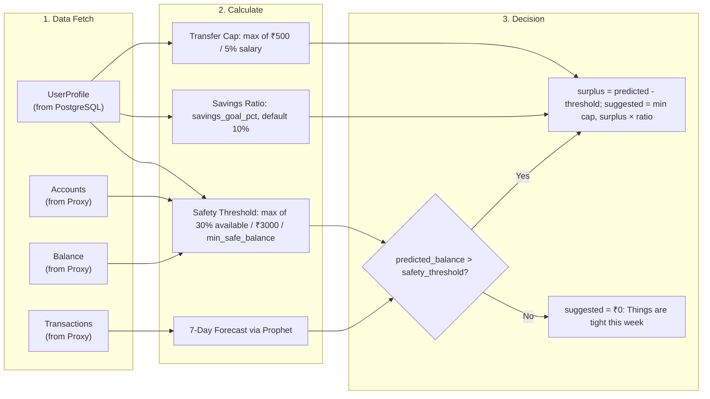
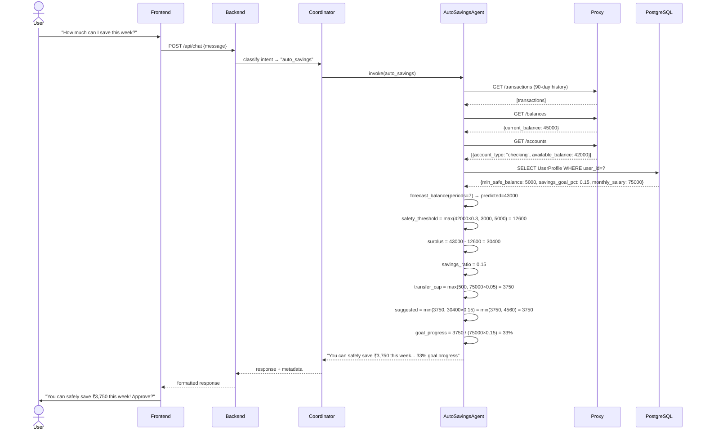

# 08 · Auto Micro-Savings

> [← 07 · Recurring Payments](07-recurring-payments.md) · **Auto Savings** · [09 · Action Engine →](09-action-engine.md)

---

## Overview

The Auto Micro-Savings feature uses the **AutoSavingsAgent** to intelligently recommend safe amounts to transfer from checking to savings. The agent analyses the user's 7-day Prophet forecast, compares the predicted balance against a **dynamic safety threshold** (derived from account data and user profile preferences), and suggests moving a percentage of the forecasted surplus.

Key design principles:
- **Never suggest savings that would jeopardise upcoming bills** — the safety threshold incorporates a minimum of `max(30% of available balance, ₹3,000)` or the user's configured `min_safe_balance`.
- **Personalised sizing** — transfer amount is capped by `5% of monthly salary` or ₹500 (whichever is higher), and scaled by the user's `savings_goal_pct`.
- **User approval required** — the agent recommends an amount and asks the user to approve; it never auto-executes without consent.

---

## Savings Calculation Pipeline



---

## Sequence Diagram



---

## Example Scenarios

### Scenario A: Healthy Surplus

**Profile:** Monthly salary ₹75,000, savings goal 15%, min safe balance ₹5,000.

```json
{
  "intent_handled": "auto_savings",
  "suggested_amount": 3750,
  "goal_progress": 0.33,
  "safety_threshold": 12600,
  "savings_ratio": 0.15,
  "transfer_cap": 3750
}
```

**Response:** "Good news! Based on your forecast, you can safely save ₹3,750 this week without affecting your upcoming bills. This would bring your savings goal progress to 33%. Would you like to approve this micro-transfer?"

### Scenario B: Tight Week

**Profile:** Same profile, but predicted balance = ₹11,000 (below safety threshold ₹12,600).

```json
{
  "intent_handled": "auto_savings",
  "suggested_amount": 0,
  "goal_progress": 0.0,
  "safety_threshold": 12600,
  "savings_ratio": 0.15,
  "transfer_cap": 3750
}
```

**Response:** "Based on your forecast, things are a bit tight this week so I am not suggesting any auto-savings right now."

### Scenario C: No Profile (Default Settings)

**Profile:** null — uses defaults: `savings_ratio=0.10`, `transfer_cap=₹500`, `safety_threshold=₹5,000`.

```json
{
  "suggested_amount": 500,
  "goal_progress": 0.60,
  "safety_threshold": 5000,
  "savings_ratio": 0.10,
  "transfer_cap": 500
}
```

---

## Decision Table

| Trigger | Agent Action | Outcome |
|---|---|---|
| User asks "how much can I save?" | Run full savings pipeline | Suggested amount returned |
| predicted_balance > safety_threshold | Calculate surplus × ratio | Suggestion ≥ ₹50 |
| predicted_balance ≤ safety_threshold | Suggest ₹0 | "Things are tight" message |
| Suggested amount < ₹50 | Round down to ₹0 | Skip micro-savings this cycle |
| No UserProfile exists | Use defaults (10%, ₹500 cap) | Generic recommendation |
| User approves transfer | Action engine executes `transfer_savings` | Money moved to savings account |
| Proxy unreachable | Fallback to generated data | Estimate-based suggestion |

---

| ← Previous | Current | Next → |
|---|---|---|
| [07 · Recurring Payments](07-recurring-payments.md) | **08 · Auto Savings** | [09 · Action Engine](09-action-engine.md) |
