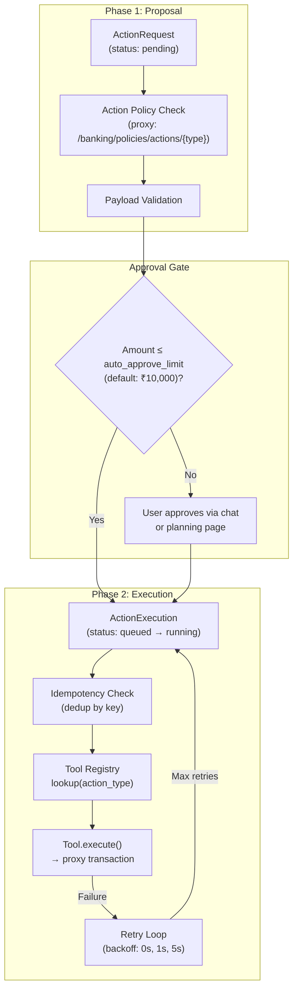
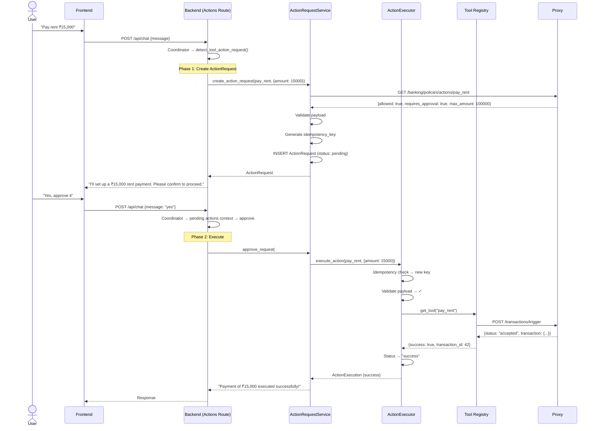

# 09 · Action Request & Execution Engine

> [← 08 · Auto Savings](08-auto-savings.md) · **Action Engine** · [10 · Real-Time Events →](10-realtime-events.md)

---

## Overview

The Action Engine is CareBank's two-phase execution pipeline. When a user requests a sensitive operation (payment, transfer, schedule management), the system first creates an **ActionRequest** (phase 1: proposal + policy check), then executes it via an **ActionExecution** (phase 2: tool invocation with retries and idempotency).

This pattern provides: a human-in-the-loop approval gate for high-value operations, idempotent re-execution for reliability, payload validation before tool dispatch, and a retry loop with exponential backoff for transient failures.

The Tool Registry maps action types (e.g. `pay_rent`, `transfer_savings`, `pay_gas`) to executable tool functions. Each tool integrates with the proxy's `POST /transactions/trigger` endpoint for actual financial operations.

---

## Two-Phase Architecture



---

## Sequence Diagram: Full Lifecycle



---

## Retry Behaviour

The executor uses exponential backoff with a fixed schedule:

| Attempt | Delay Before | Behaviour |
|---|---|---|
| 1 | 0s | Immediate execution |
| 2 | 1s | First retry after 1 second |
| 3 | 5s | Second retry after 5 seconds |
| — | — | Max retries exceeded → failure |

**Non-retryable errors** (immediate failure):
- `ToolNotFoundError` — unknown action type
- `ValueError` — invalid payload
- `IdempotencyConflictError` — hash mismatch
- `PayloadValidationError` — schema violation

**Retryable errors** (retry with backoff):
- Network timeouts to proxy
- Transient proxy errors (5xx)
- Connection refused

---

## Example Payloads

### ActionRequest (Database)
```json
{
  "id": 12,
  "user_id": "user_a3f7c1e2",
  "action_type": "pay_rent",
  "action_payload_json": {
    "amount": 15000,
    "description": "Payment requested via chat"
  },
  "policy_snapshot_json": {
    "allowed": true,
    "requires_approval": true,
    "max_amount": 100000
  },
  "status": "pending",
  "idempotency_key": "exec_user_a3f7c1e2_pay_rent_abc123",
  "expires_at": "2026-05-28T04:00:00Z"
}
```

### ActionExecution (Database)
```json
{
  "id": 8,
  "user_id": "user_a3f7c1e2",
  "approval_request_id": 12,
  "action_type": "pay_rent",
  "status": "success",
  "attempt_count": 1,
  "max_retries": 2,
  "idempotency_key": "exec_user_a3f7c1e2_pay_rent_abc123",
  "request_payload_json": {"amount": 15000},
  "result_payload_json": {"transaction_id": 42, "status": "accepted"},
  "started_at": "2026-05-21T04:00:01Z",
  "finished_at": "2026-05-21T04:00:02Z"
}
```

---

## Supported Action Types

| Action Type | Tool | Description |
|---|---|---|
| `pay_rent` | `pay_tool` | Pay rent to registered beneficiary |
| `pay_bill` | `pay_tool` | Pay generic bill |
| `pay_gas` | `pay_tool` | Pay gas/LPG bill |
| `pay_utility` | `pay_tool` | Pay electricity/water |
| `transfer_savings` | `transfer_tool` | Move money to savings account |
| `record_note` | `note_tool` | Record a financial note |

---

## Decision Table

| Trigger | Engine Action | Outcome |
|---|---|---|
| User says "pay rent 15k" | Create ActionRequest (pending) | User prompted to approve |
| Amount ≤ `auto_approve_limit` | Auto-approve, skip user confirmation | Direct execution |
| User approves request | Transition to ActionExecution | Payment executes |
| User rejects request | Status → "rejected" | No execution |
| Request expires (7 days) | Status → "expired" | No execution |
| Idempotency key exists (completed) | Return cached execution | No duplicate |
| Payload validation fails | Status → "failure" | Error returned immediately |
| Tool execution fails (retryable) | Retry up to `max_retries` | Success or final failure |
| Tool execution fails (non-retryable) | Immediate failure | Error formatted and returned |

---

| ← Previous | Current | Next → |
|---|---|---|
| [08 · Auto Savings](08-auto-savings.md) | **09 · Action Engine** | [10 · Real-Time Events](10-realtime-events.md) |
