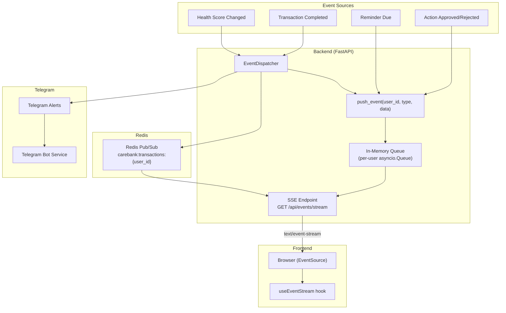
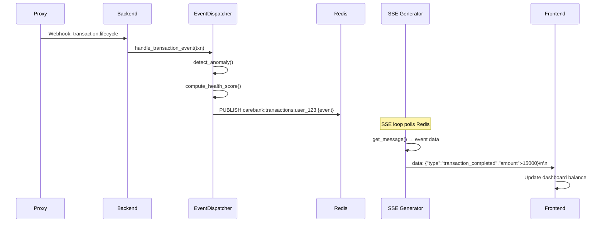
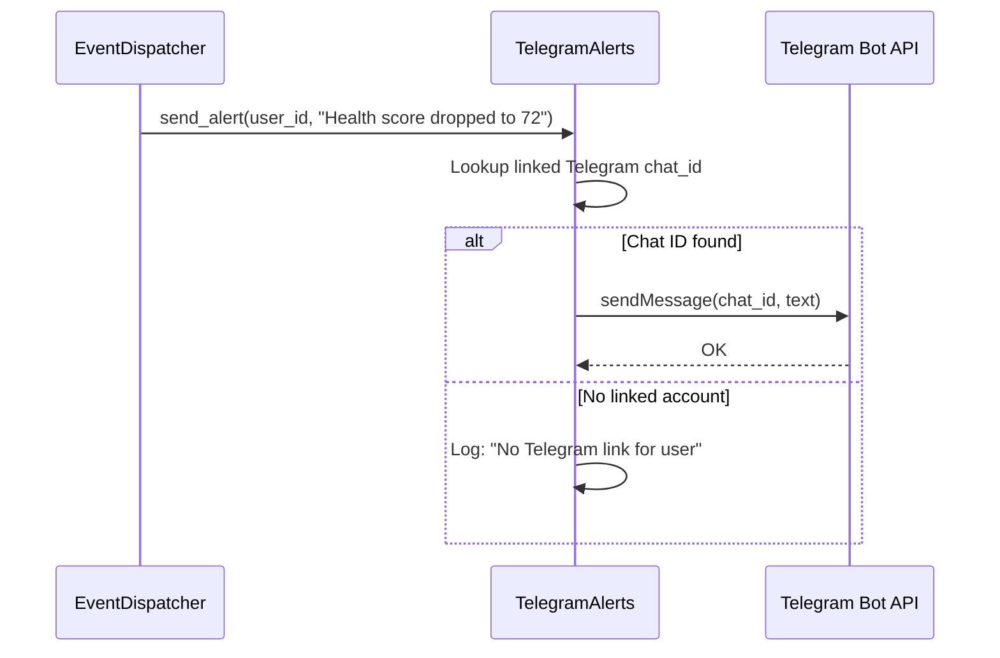

# 10 · Real-Time Events & Communication

> [← 09 · Action Engine](09-action-engine.md) · **Real-Time Events** · [11 · Admin & Observability →](11-admin-observability.md)

---

## Overview

CareBank supports three real-time communication channels: **Server-Sent Events (SSE)** for live browser updates, **Redis Pub/Sub** for inter-service event distribution, and **Telegram Bot** integration for out-of-app notifications. All three are orchestrated by the `event_dispatcher` service and the `push_event` API in the events module.

The SSE endpoint (`GET /api/events/stream`) merges two event sources: an in-memory queue (for push events from within the backend) and a Redis pub/sub channel (for cross-instance events). The frontend connects via the `useEventStream` hook which handles automatic reconnection with exponential backoff (up to 5 retries, max 30-second delay).

---

## Communication Architecture

---

## SSE Stream: Step-by-Step

### 1. Frontend connects

| Repo | What happens |
|---|---|
| **Frontend** | `useEventStream` hook creates `EventSource` to `GET /api/events/stream?token=<jwt>` |
| **Backend** | `events.py` validates JWT, creates per-user `asyncio.Queue`, subscribes to Redis channel `carebank:transactions:{user_id}` |

### 2. Event loop

| Repo | What happens |
|---|---|
| **Backend** | SSE endpoint enters infinite loop. Priority: (1) check in-memory queue (non-blocking), (2) check Redis pub/sub (1s timeout), (3) send keepalive every 5 seconds. |
| **Frontend** | `EventSource.onmessage` parses JSON, calls `onEvent` callback. Keepalive comments are silently ignored. |

### 3. Event arrives

| Repo | What happens |
|---|---|
| **Backend** | EventDispatcher calls `push_event("user_123", "transaction_completed", {...})`. Payload is enqueued to all connected SSE clients for that user. |
| **Frontend** | Hook processes event, triggers UI updates (e.g. refresh balance widget). |

### 4. Connection drops

| Repo | What happens |
|---|---|
| **Frontend** | `EventSource.onerror` fires. Hook closes connection, increments retry counter, schedules reconnect with backoff: `min(1000 × 2^retries, 30000)ms`. Max 5 retries. |
| **Backend** | `asyncio.CancelledError` caught in SSE generator. Queue removed from `_user_queues`. Redis pub/sub unsubscribed and closed. |

---

## Sequence Diagram: Transaction Event → SSE Push

---

## Telegram Bot Integration

CareBank supports a Telegram bot for out-of-app notifications. The bot uses two access modes:

| Mode | `TELEGRAM_DM_POLICY` | Behaviour |
|---|---|---|
| **Pairing** | `pairing` | User must link Telegram account by sending a pairing code |
| **Allowlist** | `allowlist` | Only pre-approved Telegram IDs can interact |

### Telegram Alert Flow

---

## Event Types

| Event Type | Source | Payload |
|---|---|---|
| `connected` | SSE endpoint | `{type, user_id}` |
| `transaction_completed` | EventDispatcher | `{type, transaction_id, amount, category}` |
| `health_score_updated` | EventDispatcher | `{type, score, previous_score}` |
| `action_approved` | ActionRequestService | `{type, request_id, action_type}` |
| `action_rejected` | ActionRequestService | `{type, request_id, reason}` |
| `reminder_due` | ReminderWorker | `{type, checklist_item_id, description}` |
| `nudge` | CommunicationAgent | `{type, message, anomaly}` |

---

## Reconnection Backoff Schedule

| Retry # | Delay | Cumulative |
|---|---|---|
| 1 | 1s | 1s |
| 2 | 2s | 3s |
| 3 | 4s | 7s |
| 4 | 8s | 15s |
| 5 | 16s | 31s |
| — | Max reached | Connection abandoned |

---

## Decision Table

| Trigger | System Action | Outcome |
|---|---|---|
| Frontend mounts dashboard | `useEventStream` connects SSE | Real-time updates enabled |
| Transaction webhook arrives | EventDispatcher → push_event | SSE data frame sent |
| Redis unavailable | SSE falls back to push-only mode | In-memory queue still works |
| SSE connection drops | Frontend retries with backoff | Auto-reconnect (up to 5 attempts) |
| Health score drops ≥ 5 pts | Nudge via SSE + Telegram | User notified on both channels |
| Telegram not linked | Alert logged, skipped | No Telegram message sent |
| Keepalive timer (5s) | Send SSE comment `: keepalive` | Connection kept alive |

---

| ← Previous | Current | Next → |
|---|---|---|
| [09 · Action Engine](09-action-engine.md) | **10 · Real-Time Events** | [11 · Admin & Observability](11-admin-observability.md) |
