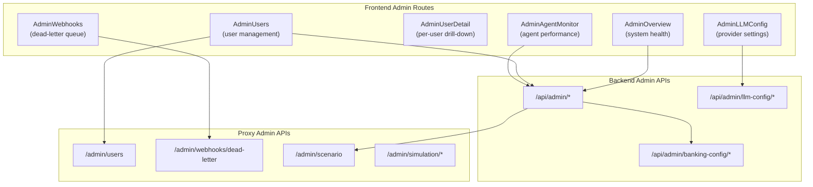
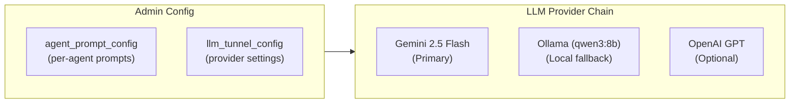
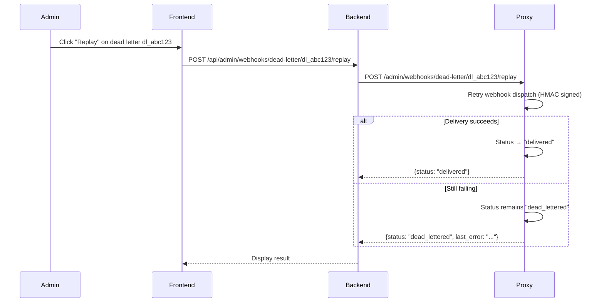
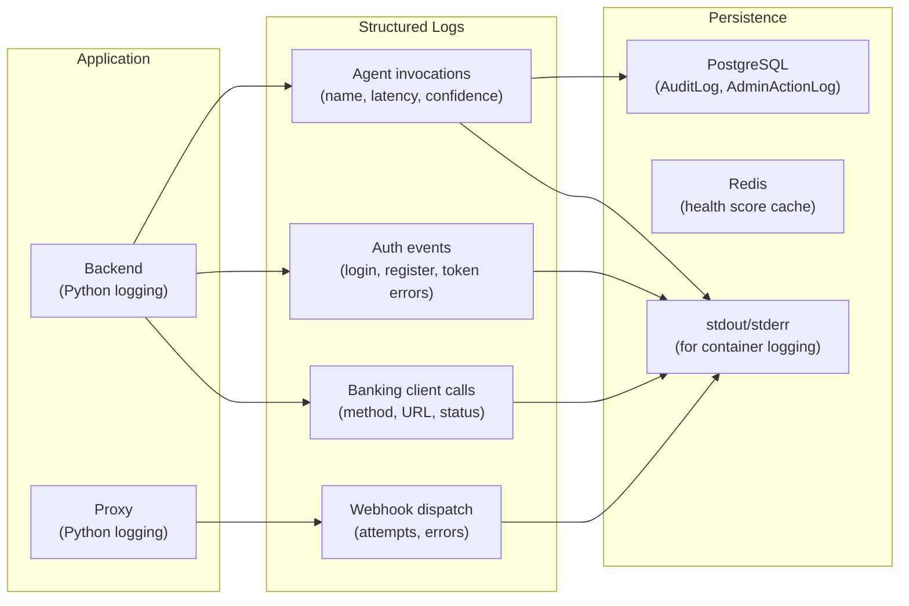

# 11 · Admin & Observability

> [← 10 · Real-Time Events](10-realtime-events.md) · **Admin & Observability** · [12 · Security & Compliance →](12-security-compliance.md)

---

## Overview

CareBank's admin layer provides a centralised control panel for managing users, monitoring agent behaviour, configuring LLM providers, managing banking connector settings, and handling webhook failures. The admin interface spans both the **frontend** (dedicated `/admin` routes with role-guarded layout) and the **backend** (admin-only API endpoints protected by `require_admin` dependency).

The observability stack centres around structured logging, audit trails in PostgreSQL, and real-time agent monitoring. Every agent interaction, compliance check, and admin action is recorded in the database with full provenance metadata.

---

## Admin Dashboard Architecture



---

## Admin Features

### 1. User Management

Admins can view all registered users, their balances (via proxy), account status, and detailed transaction history.

**Flow:** Frontend → `GET /api/admin/users` → Backend queries PostgreSQL for user list + calls proxy `GET /admin/users` for balance data.

### 2. Agent Monitoring

The Agent Monitor page shows:
- Active agents and their descriptions
- Recent invocation logs from `AuditLog` table
- Latency percentiles per agent
- Error rates and fallback counts

### 3. LLM Configuration

Admins can configure which LLM provider to use per environment, with fallback chains:



**Configurable settings:**
- Provider selection (Gemini/Ollama/OpenAI)
- Model name and temperature
- Custom system prompts per agent + environment
- Auto-pull for Ollama models

### 4. Banking Connector Configuration

Admins can update the proxy connection settings at runtime without redeploying:

```json
POST /api/admin/banking-config
{
  "environment": "production",
  "base_url": "https://proxy.carebank.io",
  "secret": "new-api-secret-encrypted",
  "request_timeout_sec": 30,
  "is_active": true
}
```

Secrets are encrypted at rest using `core/crypto.py` encryption manager.

### 5. Webhook Dead-Letter Queue

Failed webhooks are stored as dead letters. Admins can:
- View all dead-lettered webhooks with error details
- Filter by status (`dead_lettered`, `delivered`)
- Replay individual dead letters to a new or original URL



### 6. Scenario Triggering

Admins can trigger predefined scenarios on user accounts for demo/testing purposes:

```json
POST /admin/scenario
{
  "user_id": "user_a3f7c1e2",
  "scenario_type": "salary_credit"
}
```

This injects mock transactions into the user's proxy state.

---

## Audit Trail

Every significant action is logged to the `AuditLog` or `AdminActionLog` table:

| Table | Records |
|---|---|
| `AuditLog` | Agent interactions, compliance checks, chat messages |
| `AdminActionLog` | Admin config changes, user management, bootstrap actions |

**AuditLog entry:**
```json
{
  "user_id": "user_a3f7c1e2",
  "user_message": "What if I spend 50k?",
  "intent": "what_if",
  "agent_used": "IntelligenceAgent",
  "agent_response": "If you spend ₹50,000..."
}
```

**AdminActionLog entry:**
```json
{
  "admin_user_id": "user_admin_01",
  "action_type": "update_llm_config",
  "resource_type": "llm_tunnel_config",
  "resource_id": "5",
  "environment": "production",
  "before_value": "{provider: 'ollama', model: 'qwen3:8b'}",
  "after_value": "{provider: 'gemini', model: 'gemini-2.5-flash'}",
  "status": "success"
}
```

---

## Logging Architecture



---

## Decision Table

| Trigger | Admin Action | Outcome |
|---|---|---|
| View system health | Dashboard loads overview metrics | Agent stats, user counts displayed |
| Dead letter webhook exists | Admin clicks "Replay" | Webhook re-dispatched |
| LLM provider needs change | Admin updates config in UI | New provider used for next invocation |
| Banking API URL changes | Admin updates connector config | Runtime config applied (no redeploy) |
| User needs investigation | Admin drills into user detail | Full transaction + agent history |
| Demo scenario needed | Admin triggers scenario | Mock data injected into proxy state |
| Suspicious activity | Review audit logs | Full provenance trail available |

---

| ← Previous | Current | Next → |
|---|---|---|
| [10 · Real-Time Events](10-realtime-events.md) | **11 · Admin & Observability** | [12 · Security & Compliance](12-security-compliance.md) |
