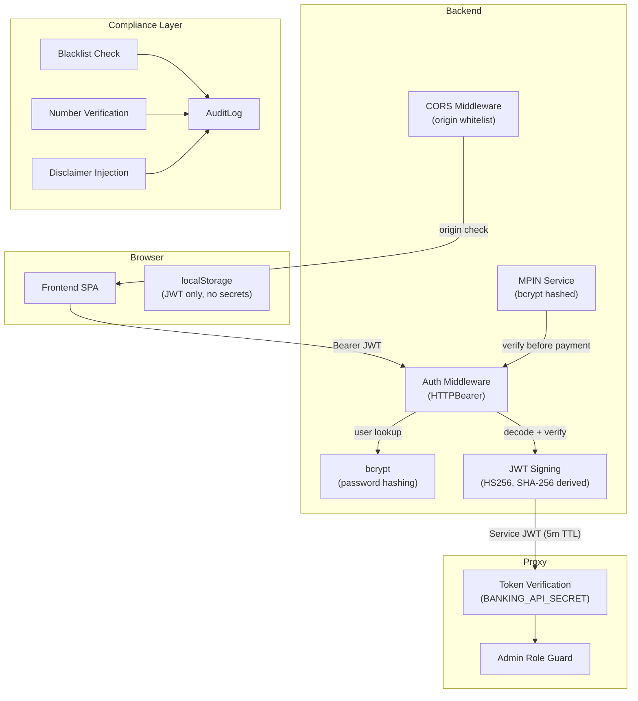
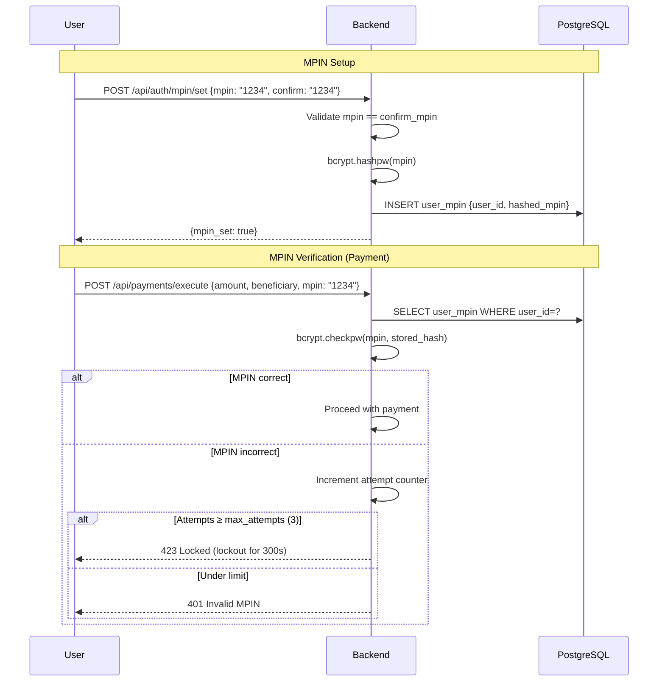
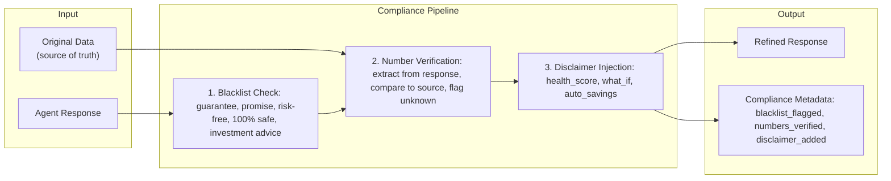

# 12 · Security & Compliance

> [← 11 · Admin & Observability](11-admin-observability.md) · **Security & Compliance** · [13 · Core Topology →](13-core-topology.md)

---

## Overview

CareBank implements a **defence-in-depth** security model across all three repositories. Authentication uses bcrypt for password hashing and HMAC-SHA256 for JWT signing. The system enforces user isolation at every layer — each user can only access their own data, enforced via JWT claims in both the backend and proxy. Sensitive operations require MPIN verification, and all agent-generated responses pass through a Compliance Guard before reaching the user.

The proxy layer provides an additional security boundary: the backend authenticates to the proxy using short-lived service JWTs (5-minute TTL) signed with a shared secret (`BANKING_API_SECRET`). This prevents direct access to the proxy from the frontend.

---

## Security Architecture

---

## Authentication Layers

### Layer 1: Frontend → Backend (User JWT)

| Property | Value |
|---|---|
| Algorithm | HS256 |
| Secret | `JWT_SECRET` (derived from `BANKING_API_SECRET` via SHA-256 if not set) |
| TTL | 24 hours (configurable `JWT_EXPIRY_HOURS`) |
| Payload | `{user_id, email, role, iat, exp}` |
| Storage | `localStorage` (frontend) |
| Validation | Client-side expiry check + server-side `GET /api/auth/me` |

### Layer 2: Backend → Proxy (Service JWT)

| Property | Value |
|---|---|
| Algorithm | HS256 |
| Secret | `BANKING_API_SECRET` (shared secret) |
| TTL | 5 minutes (300 seconds) |
| Payload | `{user_id, role, iat, exp}` |
| Minted by | `BankingClient._auth_headers()` |
| Verified by | `auth.py → verify_request_token()` (proxy) |

### Layer 3: Webhook Signing (Proxy → Backend)

| Property | Value |
|---|---|
| Algorithm | HMAC-SHA256 |
| Secret | `PROXY_WEBHOOK_SECRET` or `BANKING_API_SECRET` |
| Headers | `X-CareBank-Timestamp`, `X-CareBank-Signature` |
| Signed payload | `"{timestamp}.{json_body}"` |

---

## MPIN (Mobile PIN) Security

MPIN is used for transaction authorisation:

**MPIN Controls:**
- `MPIN_SESSION_TTL_SECONDS = 900` — verified MPIN cached for 15 minutes
- `MPIN_MAX_ATTEMPTS = 3` — lockout after 3 failures
- `MPIN_LOCKOUT_SECONDS = 300` — 5-minute lockout

---

## User Isolation

Every data access is scoped by `user_id`:

| Layer | Isolation Mechanism |
|---|---|
| **Backend routes** | JWT-extracted `user_id` injected via `get_current_user` dependency |
| **Database queries** | All queries filter by `User.user_id` |
| **Proxy state** | Per-user state namespace in SQLite (`ensure_state(storage, user_id)`) |
| **Proxy cache** | Fingerprints include `user_id` |
| **Redis pub/sub** | Channel keyed by `user_id`: `carebank:transactions:{user_id}` |
| **SSE streams** | Per-user queue: `_user_queues[user_id]` |

---

## Compliance Guard Pipeline

**Blacklist terms** → replaced with `[REDACTED]`
**Number hallucinations** → flagged in metadata (response still sent)
**Disclaimers** → appended: *"CareBank insights are for informational purposes and do not constitute formal financial advice."*

---

## CORS Configuration

| Environment | Behaviour |
|---|---|
| **Development** | Auto-expand localhost aliases: `localhost`, `127.0.0.1`, `0.0.0.0` for ports 5173, 3000, 4173 |
| **Production** | Only explicitly configured origins (empty = no CORS allowed) |
| **Custom** | `CORS_ORIGINS` env var: comma-separated or JSON array |

---

## Secrets Management

| Secret | Used By | Purpose |
|---|---|---|
| `BANKING_API_SECRET` | Backend + Proxy | Shared secret for service JWT signing |
| `JWT_SECRET` | Backend | User JWT signing (derived from above if not set) |
| `MOCKBANK_WEBHOOK_SECRET` | Proxy | Webhook HMAC signing |
| `GEMINI_API_KEY` | Backend + Proxy | Gemini AI API access |
| `OPENAI_API_KEY` | Backend | OpenAI LLM access (optional) |
| `TELEGRAM_BOT_TOKEN` | Backend | Telegram bot access |
| Banking connector secret | Backend DB | Encrypted at rest via `crypto.py` |

---

## Decision Table

| Trigger | Security Action | Outcome |
|---|---|---|
| Invalid JWT on any request | 401 Unauthorized | Request rejected |
| Expired JWT | 401 + client-side logout | User redirected to login |
| Non-admin accesses `/admin/*` | 403 Forbidden | Access denied |
| MPIN wrong (< max attempts) | 401 Invalid MPIN | Attempt counted |
| MPIN wrong (≥ max attempts) | 423 Locked | 5-minute lockout |
| Agent says "guaranteed returns" | Blacklist → `[REDACTED] returns` | Term sanitised |
| Agent invents number not in data | `numbers_verified=false` | Warning flagged |
| What-if response generated | Disclaimer auto-appended | Legal protection |
| CORS request from unknown origin | Request blocked | Browser enforces |
| `BANKING_API_SECRET` not configured | Proxy returns 503 | All proxy calls fail |

---

| ← Previous | Current | Next → |
|---|---|---|
| [11 · Admin & Observability](11-admin-observability.md) | **12 · Security & Compliance** | [13 · Core Topology](13-core-topology.md) |
