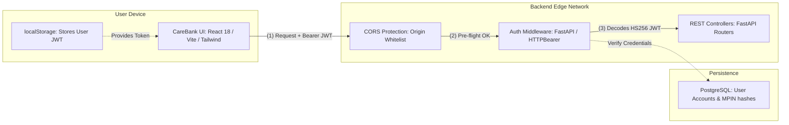
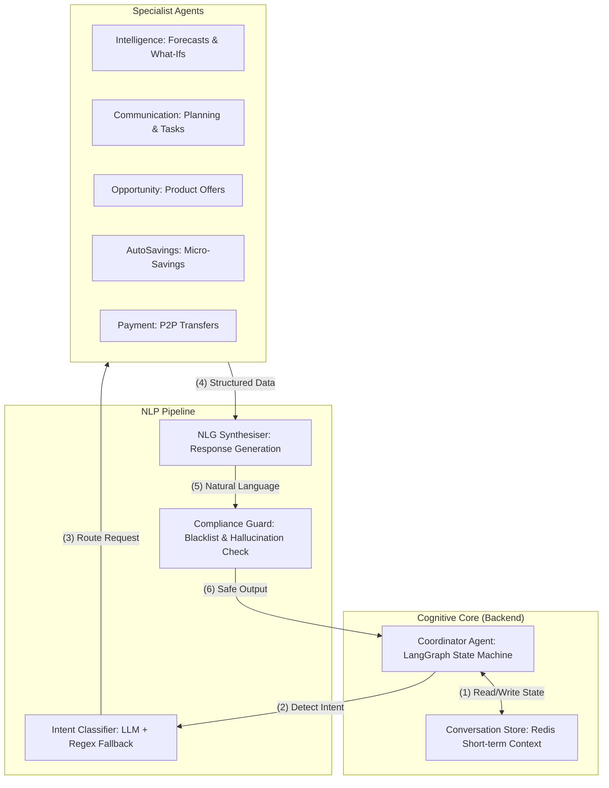
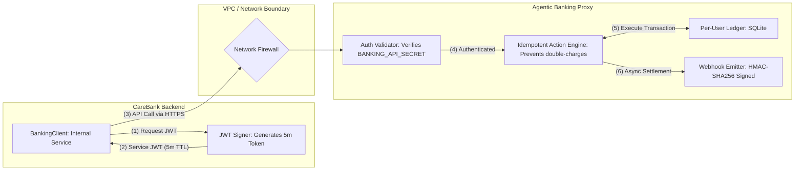
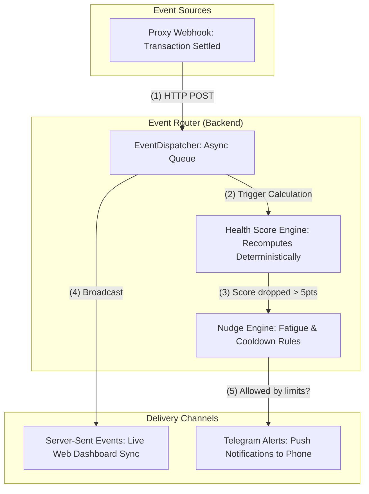
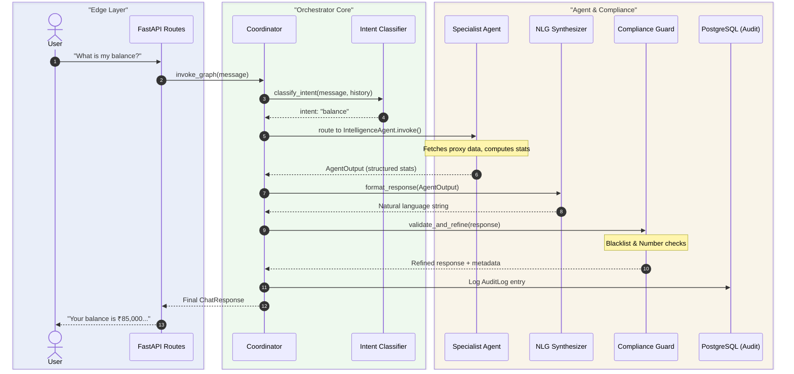
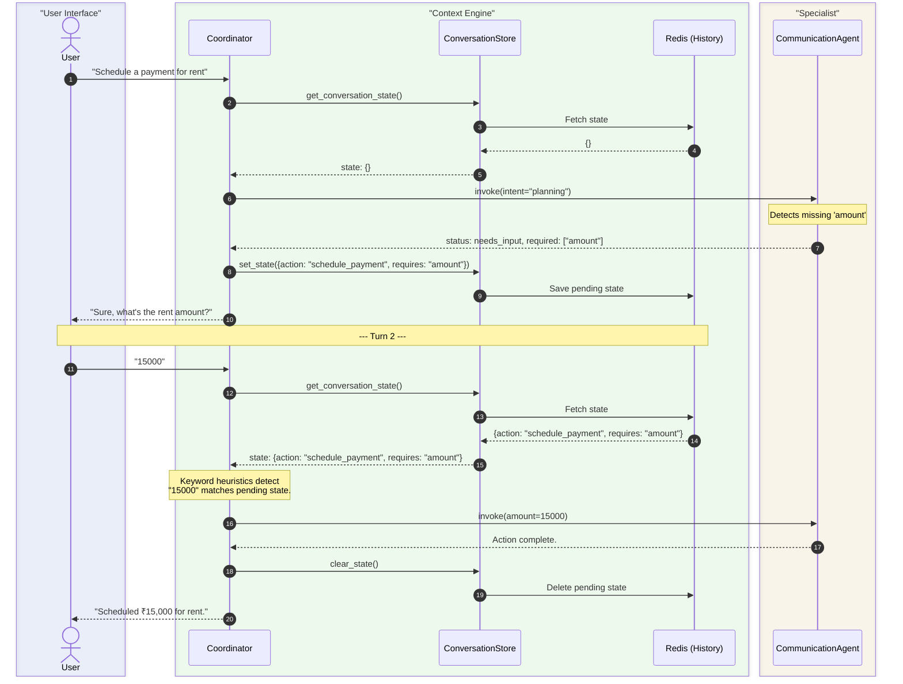
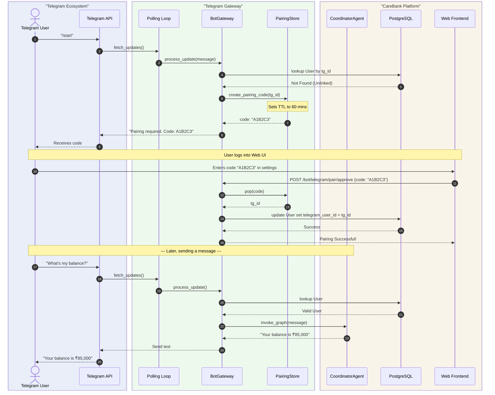

# 13 · Core System Architecture & Topology

> [← 12 · Security & Compliance](12-security-compliance.md) · **Core System Topology** · [README →](README.md)

---

## Overview

This document presents the overarching CareBank architecture, broken down into **presenter-friendly component topologies** designed for onboarding newcomers. 

Instead of a single overwhelming diagram, the system is split into four high-level but detailed domains: **Edge & Web**, **AI Orchestration**, **Banking Proxy & Security**, and **Real-Time & Omni-Channel**. Each diagram highlights the specific technologies used, the security boundaries, and the flow of data. Following the component diagrams, sequence diagrams detail the exact interactions over time.

---

## Part I: Component Topologies (For Presentation)

### 1.1 Web Application & Edge Topology
*Focuses on how users interact with the system securely from the browser.*

**Key Technologies & Security:**
- **Frontend**: React SPA bundled with Vite for fast HMR and optimized builds.
- **Security**: The frontend holds a stateless **User JWT (HS256)** valid for 24 hours. No secrets are exposed to the client. Passwords and MPINs are hashed with **bcrypt** in PostgreSQL.
- **API**: Built on **FastAPI**, leveraging Pydantic validation and asynchronous Python (`asyncio`) for high concurrency.

---

### 1.2 AI Orchestration Topology
*Focuses on the "Brain" of the system: how LangGraph coordinates multiple specialist AI agents.*

**Key Technologies & Security:**
- **Orchestration**: **LangGraph** manages the state transitions. If the user misses a parameter (e.g. an amount for rent), the state is saved to **Redis**, and the LLM pauses to ask for it.
- **LLM Engine**: Powered by **Gemini 2.5 Flash** (or local Ollama fallback), configured via admin prompts in the database.
- **Compliance**: The `Compliance Guard` is a hard-coded security layer that runs *after* the LLM. It intercepts the response to strip blacklisted terms ("guaranteed returns") and flags fabricated numbers.

---

### 1.3 Secure Proxy & Core Banking Topology
*Focuses on how the Backend safely communicates with the external Banking Proxy without exposing it to the frontend.*

**Key Technologies & Security:**
- **Isolation**: The Frontend **cannot** talk to the Proxy. Only the Backend can.
- **Service JWTs**: The Backend signs a short-lived token (5 minutes) using a shared secret (`BANKING_API_SECRET`). The proxy verifies this token for every incoming request.
- **Idempotency**: The Proxy Action Engine uses unique `idempotency_keys` for every transaction. If a network blip causes a retry, the user is never charged twice.
- **Webhooks**: When a transaction settles in the proxy, it fires an async webhook back to the backend. This payload is signed with **HMAC-SHA256** to guarantee authenticity.

---

### 1.4 Omni-Channel & Real-Time Topology
*Focuses on how asynchronous events and notifications reach the user across devices.*

**Key Technologies & Security:**
- **SSE (Server-Sent Events)**: A lightweight, unidirectional websocket alternative used to push live balance/score updates to the React frontend the millisecond a proxy webhook clears.
- **Telegram Bot**: Users bind their Telegram app via a secure 6-digit hex pairing code.
- **Fatigue Protection**: The Nudge engine ensures users aren't spammed. It strictly enforces `DAILY_LIMIT = 2` and a 4-hour `COOLDOWN` window between Telegram alerts.

---

## Part II: Interaction Workflows (Sequence Diagrams)

### 2.1 Agent Pipeline & Orchestration Flow

This sequence traces a standard chat request through the AI components.

---

### 2.2 Conversation Context & Memory Flow

This sequence demonstrates how LangGraph handles a `needs_input` state when the user hasn't provided enough information (e.g. the amount for a scheduled payment).

---

### 2.3 Telegram Pairing Flow

Because Telegram users start out unauthenticated, a secure 6-digit hex pairing code is used to bind their device to their CareBank web profile.

---

| ← Previous | Current | Next → |
|---|---|---|
| [12 · Security & Compliance](12-security-compliance.md) | **13 · Core System Topology** | [README](README.md) |
