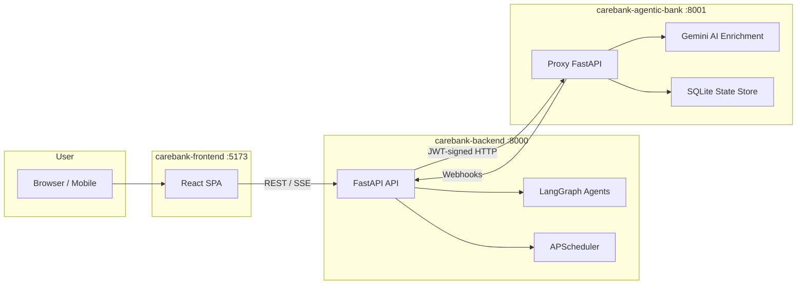

# CareBank — End-to-End Architecture Workflows

> **Presentation-ready documentation** for the CareBank multi-repo banking system.
> Last updated: 2026-05-21

---

## System Overview

CareBank is an **AI-augmented banking platform** built across three repositories that together deliver personalised financial insights, automated payments, and agentic decision-making.

| Repository | Role | Stack |
|---|---|---|
| **carebank-frontend** | User-facing SPA (Vite + React + TypeScript) | React 18, Vite, Axios, SSE |
| **carebank-backend** | Business-logic API, LangGraph agents, schedulers | FastAPI, SQLAlchemy, APScheduler, LangChain |
| **carebank-agentic-bank** | Mock banking proxy — simulates external banking APIs | FastAPI, SQLite, Gemini AI |

---

## Workflow Index

Navigate the workflows in presentation order:

| # | Workflow | File | Description |
|---|---|---|---|
| 1 | [User Onboarding](01-user-onboarding.md) | `01-user-onboarding.md` | Signup → proxy profile → MPIN → session |
| 2 | [Authentication & Session Management](02-authentication-sessions.md) | `02-authentication-sessions.md` | Login, JWT lifecycle, token refresh, admin bootstrap |
| 3 | [Conversational Agent Pipeline](03-agent-pipeline.md) | `03-agent-pipeline.md` | Chat → Coordinator → specialist agent → NLG → compliance |
| 4 | [Financial Health Score](04-health-score.md) | `04-health-score.md` | Inputs, 4-factor deterministic score, visualization |
| 5 | [What-If Simulator](05-what-if-simulator.md) | `05-what-if-simulator.md` | Expense simulation, impact analysis, risk classification |
| 6 | [Transaction Lifecycle](06-transaction-lifecycle.md) | `06-transaction-lifecycle.md` | Initiation → proxy → webhook → reconciliation |
| 7 | [Recurring Payments & Scheduling](07-recurring-payments.md) | `07-recurring-payments.md` | Rule creation, APScheduler cron, auto-execute, approval flow |
| 8 | [Auto Micro-Savings](08-auto-savings.md) | `08-auto-savings.md` | Forecast surplus, safety threshold, transfer recommendation |
| 9 | [Action Request & Execution Engine](09-action-engine.md) | `09-action-engine.md` | Action proposal, approval gate, idempotent execution, retries |
| 10 | [Real-Time Events & Communication](10-realtime-events.md) | `10-realtime-events.md` | SSE, Redis pub/sub, Telegram bot, nudge system |
| 11 | [Admin & Observability](11-admin-observability.md) | `11-admin-observability.md` | Admin dashboard, LLM config, webhook dead letters, audit logs |
| 12 | [Security & Compliance](12-security-compliance.md) | `12-security-compliance.md` | Auth flow, MPIN, compliance guard, data isolation |
| 13 | [Core System Topology](13-core-topology.md) | `13-core-topology.md` | High-level architecture, context management, Telegram bot, events |

---

## Navigation

| ← Previous | Current | Next → |
|---|---|---|
| — | **README** (you are here) | [01 · User Onboarding](01-user-onboarding.md) |
