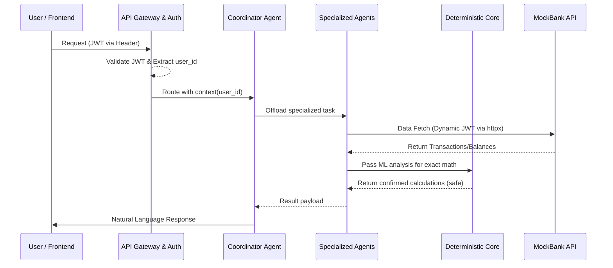
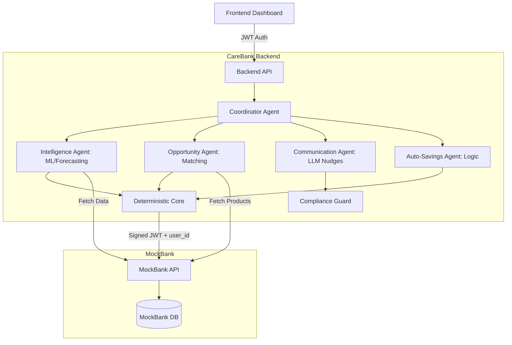

# CareBank System Architecture

> Complete guide to CareBank's workflow, data flow, and authentication mechanisms between the Backend and MockBank.

## 1. Authentication System

CareBank uses a stateless JWT (JSON Web Token) authentication architecture to secure communication between clients, the CareBank backend, and the MockBank microservice.

### 1.1 Backend Authentication
- **Client to Backend**: User authenticates with the CareBank Frontend, which receives a JWT.
- **API Gateway**: Every request to the backend includes this JWT in the `Authorization` header (`Bearer <token>`).
- **Context Isolation**: The API Gateway decodes the token and injects the isolated `user_id` context into all downstream services and AI agents. The Coordinator Agent processes requests strictly within this `user_id` scope.

### 1.2 MockBank Integration
- **Backend to MockBank**: The CareBank backend acts as a trusted client to the MockBank API.
- **Service Authentication**: It uses a dedicated JWT signed with a shared `MOCKBANK_JWT_SECRET`. 
- **Payload Structure**: The internal JWT contains the `user_id` (so MockBank knows whose data to return), an issued-at timestamp (`iat`), and an expiry time (`exp`, typically 5 minutes). Every request dynamically generates a fresh, short-lived token to ensure security.

---

## 2. Core Workflows

The system uses 5 specialized agents to handle distinct domains of the predictive banking experience.

### 2.1 Demo Scenario: Live Transaction
1. **Trigger**: A new transaction (e.g., ₹2,500 at a restaurant) is made and logged in MockBank.
2. **Detection**: MockBank emits an event (or CareBank fetches the latest transaction). 
3. **Forecasting**: The **Intelligence Agent** recalculates the end-of-month forecast using Prophet and detects any anomalies.
4. **Analysis & Storage**: The **Deterministic Core** evaluates the impact on the user's budget and stores the updated state.
5. **Nudge Decision**: The **Communication Agent** decides if a notification is needed (avoiding alert fatigue) and generates a natural-language summary.

### 2.2 Demo Scenario: What-If Simulator
1. **User Input**: User asks, "What if I spend ₹15,000 on a laptop?"
2. **Simulation**: The **Intelligence Agent** runs a simulated forecast.
3. **Calculation**: The **Deterministic Core** precisely calculates the end-of-month balance if the purchase is made.
4. **Cross-Selling**: The **Opportunity Agent** notices liquidity drops and fetches a suitable loan/EMI product from MockBank.
5. **Response Delivery**: The **Communication Agent** delivers the warning and offers the pre-approved Opportunity Agent deal.

### 2.3 Demo Scenario: Auto-Micro-Savings
1. **Detection**: The **Intelligence Agent** detects surplus cash flow.
2. **Proposal**: The **Auto-Savings Agent** calculates a safe amount to save (e.g., ₹300) and prepares a proposal.
3. **Approval Request**: The **Communication Agent** sends a natural nudge requesting user approval.
4. **Execution**: Upon user approval, the **Deterministic Core** interacts with MockBank to execute the transfer.
5. **Score Update**: The user's Financial Health Score improves.

---

## 3. Data Flow Architecture

### 3.1 Interaction Data Flow (Mermaid Diagram)

### 3.2 System Component Data Flow

---

## 4. Security & Safety

- **Deterministic Core**: LLMs **never** perform math. The Deterministic Core handles all real financial logic to prevent hallucinations.
- **Compliance Guard**: A final interceptor layer sits before the user receives messages. It verifies outputs against regulatory rules and adds required disclaimers.
- **Stateless Scale**: Auth context is purely token-based, meaning the backend can scale horizontally without sticky sessions.